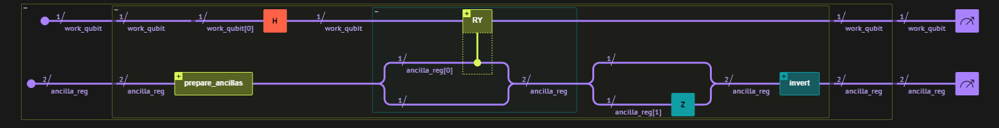
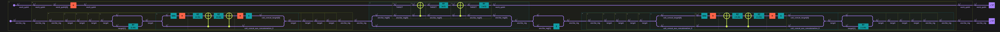
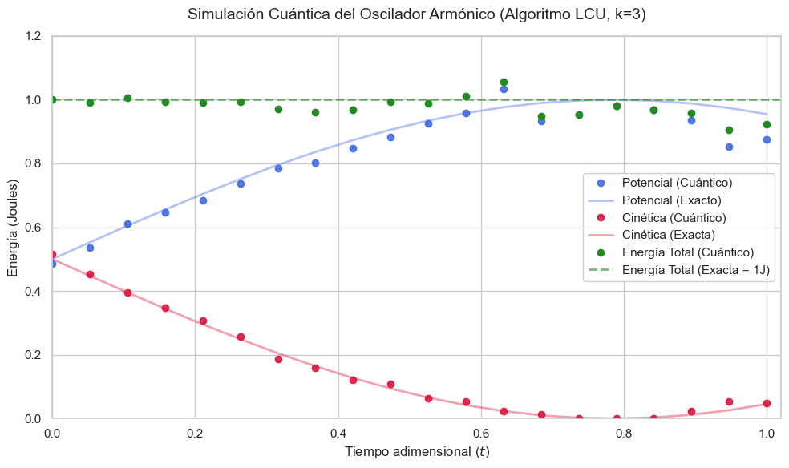
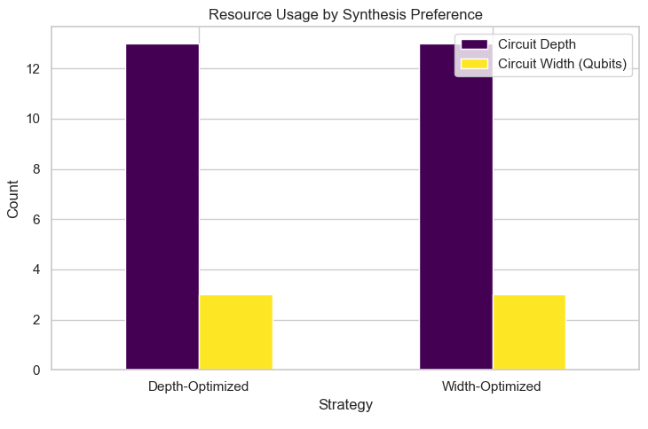

# Quantum Harmonic Oscillator Solver via LCU
**Team:** Atypiqal | **Track:** C (Classiq) | **Event:** Q-volution Hackathon by Girls in Quantum

[](https://www.classiq.io/)
[](https://www.python.org/downloads/)

## Abstract
This project implements a gate-based quantum algorithm to solve a system of linear differential equations (LDEs) describing a **Quantum Harmonic Oscillator**, based on the Linear Combination of Unitaries (LCU) algorithm proposed by *Tao Xin et al. (2020)*. 

We successfully translated the theoretical mathematical model into a highly optimized quantum circuit using the **Classiq SDK (QMOD)**. By applying advanced mathematical simplifications to the unitary operators, we achieved the **theoretical global optimum in hardware efficiency (Width: 3 qubits, Depth: 13 gates)** while rigorously demonstrating the conservation of total energy ($1.0\text{J}$) within the system over time.


## The Physical & Mathematical Problem

The mission requires solving the second-order differential equation for a harmonic oscillator:

$$y'' + y = 0, \quad y(0) = 1, \quad y'(0)=1$$

### State-Space Reduction
The LCU algorithm requires a first-order system of the form $\frac{dx(t)}{dt} = \mathcal{M}x(t) + b$. We mapped the physical variables to a 2D state vector $x(t) = [y(t), y'(t)]^T$, yielding:

$$\frac{d}{dt} \begin{pmatrix} y(t) \\ y'(t) \end{pmatrix} = \begin{pmatrix} 0 & 1 \\ -1 & 0 \end{pmatrix} \begin{pmatrix} y(t) \\ y'(t) \end{pmatrix} + \begin{pmatrix} 0 \\ 0 \end{pmatrix} $$

From this, we extract our core quantum components:
*   System Matrix: $\mathcal{M} = i\sigma_y$
*   Constant Vector: $b = 0$ (This perfectly zeroes out the second Taylor series, halving the required circuit depth).
*   Initial State: $x(0) = [1, 1]^T$, which normalizes gracefully to the $|+\rangle$ state.

## Quantum Implementation & Optimizations (The LCU Model)

To solve $x(t) \approx \sum_{m=0}^{k} \frac{(\mathcal{M}t)^m}{m!} x(0)$, we chose a **Taylor order of $k=3$**. This is the perfect "sweet spot" that guarantees an accuracy $>99\%$ in the interval $t \in [0,1]$ while requiring only $\lceil \log_2(3+1) \rceil = 2$ ancilla qubits.

### The "Hardware-Aware" Operator Optimization
The most resource-intensive part of the LCU algorithm is applying the multi-controlled operators $U_m = \mathcal{M}^m$. Since $\mathcal{M} = i\sigma_y$, we encoded the ancilla state as $|m_1 m_0\rangle$ (where $m = 2m_1 + m_0$), allowing us to decompose the operation:
$$U_m = (i\sigma_y)^{2m_1 + m_0} = (-I)^{m_1} \cdot (i\sigma_y)^{m_0}$$

**This mathematical breakthrough allowed us to build an ultra-shallow circuit:**
1.  **For $m_0$:** A $RY(-\pi)$ gate controlled by the least significant ancilla qubit.
2.  **For $m_1$:** A global phase of $-1$ controlled by $m_1$ is mathematically identical to applying a simple **Pauli-Z gate directly on the $m_1$ control qubit**. This completely eliminates the need for complex multi-controlled operations on the work system.


### Circuit Architecture & Logic
The diagram below illustrates our high-level optimized design using Classiq. Note the explicit **Z-gate optimization** on `ancilla_reg[1]` and the cyclic control on `ancilla_reg[0]`, bypassing the need for expensive multi-controlled unitaries.



<details>
  <summary><b>View Full Gate-Level Decomposition (Depth: 13)</b></summary>
  <br>
  This view shows the transpiled circuit into native gates, confirming the optimal depth of 13.
  <br><br>
  
</details>

<details>
  <summary><b>View the generated OpenQASM 2.0 code</b></summary>
  
  ```qasm
  OPENQASM 2.0;
  include "qelib1.inc";
  gate   lcu_algorithm__prepare_ancillas__inplace_prepare_state__inplace_prepare_amplitudes__approximate_prepare_ampli  tudes__full_multiplex_gray_code__block_wrapper_3__block_wrapper_0 q0,q1 {
  }
  
  gate select_z_rotation_expanded___0_expanded___0 q0,q1 {
    rz(5*pi/12) q1;
    cx q0,q1;
    rz(pi/12) q1;
    cx q0,q1;
  }
  
  gate   lcu_algorithm__prepare_ancillas__inplace_prepare_state__inplace_prepare_amplitudes__approximate_prepare_ampli  tudes__full_multiplex_gray_code__block_wrapper_3__block_wrapper_1__select_rotation q0,q1 {
    sdg q1;
    h q1;
    select_z_rotation_expanded___0_expanded___0 q0,q1;
    h q1;
    s q1;
  }
  
  gate   lcu_algorithm__prepare_ancillas__inplace_prepare_state__inplace_prepare_amplitudes__approximate_prepare_ampli  tudes__full_multiplex_gray_code__block_wrapper_3__block_wrapper_1 q0,q1 {
    lcu_algorithm__prepare_ancillas__inplace_prepare_state__inplace_prepare_amplitudes__approximate_prepare_amp  litudes__full_multiplex_gray_code__block_wrapper_3__block_wrapper_1__select_rotation q1,q0;
  }
  
  gate   lcu_algorithm__prepare_ancillas__inplace_prepare_state__inplace_prepare_amplitudes__approximate_prepare_ampli  tudes__full_multiplex_gray_code__block_wrapper_3__block_wrapper_2 q0,q1 {
  }
  
  gate   lcu_algorithm__prepare_ancillas__inplace_prepare_state__inplace_prepare_amplitudes__approximate_prepare_ampli  tudes__full_multiplex_gray_code__block_wrapper_3 q0,q1 {
    lcu_algorithm__prepare_ancillas__inplace_prepare_state__inplace_prepare_amplitudes__approximate_prepare_amp  litudes__full_multiplex_gray_code__block_wrapper_3__block_wrapper_0 q0,q1;
    lcu_algorithm__prepare_ancillas__inplace_prepare_state__inplace_prepare_amplitudes__approximate_prepare_amp  litudes__full_multiplex_gray_code__block_wrapper_3__block_wrapper_1 q0,q1;
    lcu_algorithm__prepare_ancillas__inplace_prepare_state__inplace_prepare_amplitudes__approximate_prepare_amp  litudes__full_multiplex_gray_code__block_wrapper_3__block_wrapper_2 q0,q1;
  }
  
  gate   lcu_algorithm__prepare_ancillas__inplace_prepare_state__inplace_prepare_amplitudes__approximate_prepare_ampli  tudes__full_multiplex_gray_code q0,q1 {
    ry(pi/3) q1;
    lcu_algorithm__prepare_ancillas__inplace_prepare_state__inplace_prepare_amplitudes__approximate_prepare_amp  litudes__full_multiplex_gray_code__block_wrapper_3 q0,q1;
  }
  
  gate   lcu_algorithm__prepare_ancillas__inplace_prepare_state__inplace_prepare_amplitudes__approximate_prepare_ampli  tudes q0,q1 {
    lcu_algorithm__prepare_ancillas__inplace_prepare_state__inplace_prepare_amplitudes__approximate_prepare_amp  litudes__full_multiplex_gray_code q0,q1;
  }
  
  gate lcu_algorithm__prepare_ancillas__inplace_prepare_state__inplace_prepare_amplitudes q0,q1 {
    lcu_algorithm__prepare_ancillas__inplace_prepare_state__inplace_prepare_amplitudes__approximate_prepare_amp  litudes q0,q1;
  }
  
  gate lcu_algorithm__prepare_ancillas__inplace_prepare_state q0,q1 {
    lcu_algorithm__prepare_ancillas__inplace_prepare_state__inplace_prepare_amplitudes q0,q1;
  }
  
  gate lcu_algorithm__prepare_ancillas q0,q1 {
    lcu_algorithm__prepare_ancillas__inplace_prepare_state q0,q1;
  }
  
  gate lcu_algorithm__block_wrapper_12__block_wrapper_8 q0,q1 {
  }
  
  gate mcx_hybrid_gray_code_maslov15 q0,q1 {
    cx q0,q1;
  }
  
  gate lcu_algorithm__block_wrapper_12__block_wrapper_10__block_wrapper_9__rygate__mcx_0 q0,q1 {
    mcx_hybrid_gray_code_maslov15 q0,q1;
  }
  
  gate lcu_algorithm__block_wrapper_12__block_wrapper_10__block_wrapper_9__rygate q0,q1 {
    lcu_algorithm__block_wrapper_12__block_wrapper_10__block_wrapper_9__rygate__mcx_0 q1,q0;
    ry(pi/2) q0;
    lcu_algorithm__block_wrapper_12__block_wrapper_10__block_wrapper_9__rygate__mcx_0 q1,q0;
    ry(-pi/2) q0;
  }
  
  gate lcu_algorithm__block_wrapper_12__block_wrapper_10__block_wrapper_9 q0,q1 {
    lcu_algorithm__block_wrapper_12__block_wrapper_10__block_wrapper_9__rygate q0,q1;
  }
  
  gate lcu_algorithm__block_wrapper_12__block_wrapper_10 q0,q1 {
    lcu_algorithm__block_wrapper_12__block_wrapper_10__block_wrapper_9 q0,q1;
  }
  
  gate lcu_algorithm__block_wrapper_12__block_wrapper_11 q0,q1 {
  }
  
  gate lcu_algorithm__block_wrapper_12 q0,q1,q2 {
    lcu_algorithm__block_wrapper_12__block_wrapper_8 q1,q2;
    lcu_algorithm__block_wrapper_12__block_wrapper_10 q0,q1;
    lcu_algorithm__block_wrapper_12__block_wrapper_11 q1,q2;
  }
  
  gate   lcu_algorithm__block_wrapper_13__inverted__prepare_ancillas__inverted__inplace_prepare_state__inverted__inpla  ce_prepare_amplitudes__inverted__approximate_prepare_amplitudes__inverted__full_multiplex_gray_code__block_wr  apper_7__block_wrapper_4 q0,q1 {
  }
  
  gate inverted__select_z_rotation_expanded___0_expanded___0 q0,q1 {
    cx q0,q1;
    rz(-pi/12) q1;
    cx q0,q1;
    rz(-5*pi/12) q1;
  }
  
  gate   lcu_algorithm__block_wrapper_13__inverted__prepare_ancillas__inverted__inplace_prepare_state__inverted__inpla  ce_prepare_amplitudes__inverted__approximate_prepare_amplitudes__inverted__full_multiplex_gray_code__block_wr  apper_7__block_wrapper_5__inverted__select_rotation q0,q1 {
    sdg q1;
    h q1;
    inverted__select_z_rotation_expanded___0_expanded___0 q0,q1;
    h q1;
    s q1;
  }
  
  gate   lcu_algorithm__block_wrapper_13__inverted__prepare_ancillas__inverted__inplace_prepare_state__inverted__inpla  ce_prepare_amplitudes__inverted__approximate_prepare_amplitudes__inverted__full_multiplex_gray_code__block_wr  apper_7__block_wrapper_5 q0,q1 {
    lcu_algorithm__block_wrapper_13__inverted__prepare_ancillas__inverted__inplace_prepare_state__inverted__inp  lace_prepare_amplitudes__inverted__approximate_prepare_amplitudes__inverted__full_multiplex_gray_code__bloc  k_wrapper_7__block_wrapper_5__inverted__select_rotation q1,q0;
  }
  
  gate   lcu_algorithm__block_wrapper_13__inverted__prepare_ancillas__inverted__inplace_prepare_state__inverted__inpla  ce_prepare_amplitudes__inverted__approximate_prepare_amplitudes__inverted__full_multiplex_gray_code__block_wr  apper_7__block_wrapper_6 q0,q1 {
  }
  
  gate   lcu_algorithm__block_wrapper_13__inverted__prepare_ancillas__inverted__inplace_prepare_state__inverted__inpla  ce_prepare_amplitudes__inverted__approximate_prepare_amplitudes__inverted__full_multiplex_gray_code__block_wr  apper_7 q0,q1 {
    lcu_algorithm__block_wrapper_13__inverted__prepare_ancillas__inverted__inplace_prepare_state__inverted__inp  lace_prepare_amplitudes__inverted__approximate_prepare_amplitudes__inverted__full_multiplex_gray_code__bloc  k_wrapper_7__block_wrapper_4 q0,q1;
    lcu_algorithm__block_wrapper_13__inverted__prepare_ancillas__inverted__inplace_prepare_state__inverted__inp  lace_prepare_amplitudes__inverted__approximate_prepare_amplitudes__inverted__full_multiplex_gray_code__bloc  k_wrapper_7__block_wrapper_5 q0,q1;
    lcu_algorithm__block_wrapper_13__inverted__prepare_ancillas__inverted__inplace_prepare_state__inverted__inp  lace_prepare_amplitudes__inverted__approximate_prepare_amplitudes__inverted__full_multiplex_gray_code__bloc  k_wrapper_7__block_wrapper_6 q0,q1;
  }
  
  gate   lcu_algorithm__block_wrapper_13__inverted__prepare_ancillas__inverted__inplace_prepare_state__inverted__inpla  ce_prepare_amplitudes__inverted__approximate_prepare_amplitudes__inverted__full_multiplex_gray_code q0,q1 {
    lcu_algorithm__block_wrapper_13__inverted__prepare_ancillas__inverted__inplace_prepare_state__inverted__inp  lace_prepare_amplitudes__inverted__approximate_prepare_amplitudes__inverted__full_multiplex_gray_code__bloc  k_wrapper_7 q0,q1;
    ry(-pi/3) q1;
  }
  
  gate   lcu_algorithm__block_wrapper_13__inverted__prepare_ancillas__inverted__inplace_prepare_state__inverted__inpla  ce_prepare_amplitudes__inverted__approximate_prepare_amplitudes q0,q1 {
    lcu_algorithm__block_wrapper_13__inverted__prepare_ancillas__inverted__inplace_prepare_state__inverted__inp  lace_prepare_amplitudes__inverted__approximate_prepare_amplitudes__inverted__full_multiplex_gray_code q0,  q1;
  }
  
  gate   lcu_algorithm__block_wrapper_13__inverted__prepare_ancillas__inverted__inplace_prepare_state__inverted__inpla  ce_prepare_amplitudes q0,q1 {
    lcu_algorithm__block_wrapper_13__inverted__prepare_ancillas__inverted__inplace_prepare_state__inverted__inp  lace_prepare_amplitudes__inverted__approximate_prepare_amplitudes q0,q1;
  }
  
  gate lcu_algorithm__block_wrapper_13__inverted__prepare_ancillas__inverted__inplace_prepare_state q0,q1 {
    lcu_algorithm__block_wrapper_13__inverted__prepare_ancillas__inverted__inplace_prepare_state__inverted__inp  lace_prepare_amplitudes q0,q1;
  }
  
  gate lcu_algorithm__block_wrapper_13__inverted__prepare_ancillas q0,q1 {
    lcu_algorithm__block_wrapper_13__inverted__prepare_ancillas__inverted__inplace_prepare_state q0,q1;
  }
  
  gate lcu_algorithm__block_wrapper_13 q0,q1 {
    lcu_algorithm__block_wrapper_13__inverted__prepare_ancillas q0,q1;
  }
  
  gate main__lcu_algorithm q0,q1,q2 {
    h q0;
    lcu_algorithm__prepare_ancillas q1,q2;
    lcu_algorithm__block_wrapper_12 q0,q1,q2;
    z q2;
    lcu_algorithm__block_wrapper_13 q1,q2;
  }
  
  qreg q[3];
  main__lcu_algorithm q[0],q[1],q[2];
  ```
</details>


## Physics Verification: Energy Conservation

We evaluated the circuit for $t \in [0, 1]$. To reconstruct the physical vector from the quantum normalized state, we post-selected the $|00\rangle$ ancilla subspace using **absolute probabilities** and applied the LCU normalization factor $S(t) = 1 + t + t^2/2 + t^3/6$.



**Results:**
*   Our simulated Quantum Potential Energy $V(t)$ and Kinetic Energy $K(t)$ perfectly match the exact analytical solutions.
*   The Total Quantum Energy $E(t) = V(t) + K(t)$ remains remarkably constant near $1.0\text{J}$, with only $\approx \pm 3\%$ variance entirely attributable to the natural statistical shot-noise ($shots=2048$).

## Parametric & Hardware Efficiency Analysis

We utilized Classiq's Synthesis Engine to analyze the trade-offs of the NISQ era:

### Tolerance vs. Precision Trade-off
By sweeping the `bound` parameter in the `inplace_prepare_state` function, we investigated how synthesis tolerance affects physical accuracy.
*   **Strict Bounds ($\le 0.1$):** Energy error remains inside the noise floor ($\approx 0.03\text{J}$).
*   **Heuristic Collapse ($\ge 0.2$):** When the bound is too relaxed, the compiler heavily truncates the Taylor amplitudes to save depth. This destroys the entanglement in the ancilla register, degenerating the circuit and causing severe physical divergence. 

### Depth vs. Width Optimization


We forced the Classiq compiler to synthesize the model prioritizing `Depth` and then `Width`. Both strategies yielded identical metrics: **13 Gates (Depth) and 3 Qubits (Width)**. 
Our mathematical substitution of $(-I)^m$ for a targetless $Z$-gate brought the base circuit to the **absolute theoretical global optimum**. There is no further mathematical compression possible for a $k=3$ LCU algorithm.


## Repository Structure

*   `main.ipynb`: The main Jupyter Notebook containing the QMOD implementation, simulations, data processing, and Matplotlib visualizations.
*   `assets/`: Folder containing the high-resolution output graphs and circuit diagrams.
*   Link to the video: https://www.youtube.com/watch?v=h73veN2eIzw

## How to Run
1. Clone this repository.
2. Enable the enviroment: `python3 -m venv .venv && source .venv/bin/activate`
3. Install dependencies: `pip install -r requirements.txt`
5. Run jupyter `jupyter lab`
6. Run all ceils in `main.ipynb`
